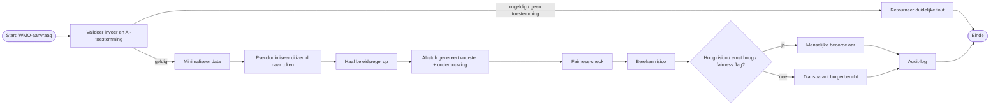
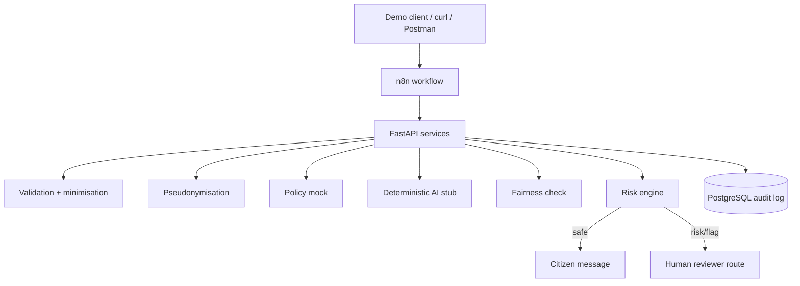

# BPMN en architectuur

## BPMN-logica
Gebruik onderstaande Mermaid als snelle visualisatie of teken hem na in draw.io/BPMN-tool.

## Architectuur

## Privacygrens
Persoonsgegevens komen de API binnen voor validatie maar worden vóór de AI-stap verwijderd. De AI-stub krijgt alleen token, leeftijdsgroep, voorziening, beschrijving, ernst en beleidscontext. In een echte productieomgeving moet vrije tekst aanvullend door PII-detectie/redactie en moeten toegang, encryptie, bewaartermijnen en logging uitgebreider worden ingericht.
