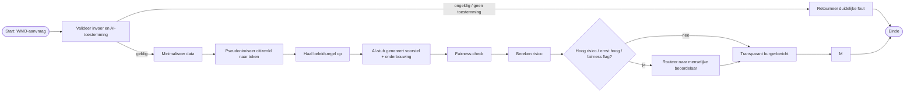
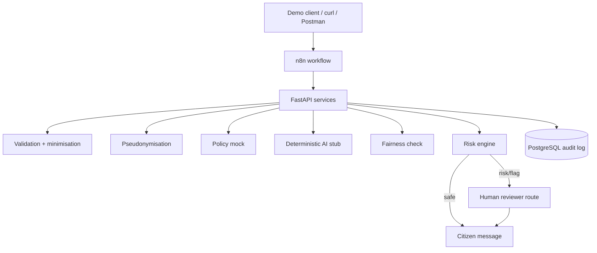

# BPMN en architectuur

## BPMN-logica
Gebruik onderstaande Mermaid als snelle visualisatie of teken hem na in draw.io/BPMN-tool.

De importeerbare BPMN 2.0-versie staat in `docs/wmo-process.bpmn`. Gebruik die voor de definitieve afbeelding of screenshot in de presentatie.

## Architectuur

## MVC- en servicelaag

De FastAPI-implementatie is opgesplitst in vier verantwoordelijkheden:

- **Model:** `app/models/` bevat de API-contracten en het database-auditmodel.
- **View:** `app/static/index.html` toont het WMO Kompas-dashboard.
- **Rolgerichte views:** `citizen.html` is het burgerportaal, `reviewer.html` is de behandelaarswerkplek en `index.html` blijft het technische demodashboard.
- **Controller:** `app/controllers/` vertaalt HTTP-verzoeken en fouten naar API-responses.
- **Services:** `app/services/` bevat alle bedrijfslogica en is onafhankelijk van FastAPI-routes.

`ProcessingService` coördineert de end-to-end API-route. De n8n-workflow gebruikt dezelfde gespecialiseerde services via hun losse endpoints. Daardoor bestaan de regels voor privacy, fairness en risico maar op één plek.

Menselijke beslissingen worden apart van de onveranderde auditregel opgeslagen in `review_decisions`. Zo blijft zichtbaar wat het systeem oorspronkelijk voorstelde en wat de behandelaar daarna heeft besloten.

## Privacygrens
Persoonsgegevens komen de API binnen voor validatie maar worden vóór de AI-stap verwijderd. De AI-stub krijgt alleen token, leeftijdsgroep, voorziening, geredigeerde beschrijving, ernst en beleidscontext. De prototype-redactie verwijdert de meegegeven naam, adres, geboortedatum en citizenId plus herkenbare e-mailadressen, Nederlandse telefoonnummers, postcodes, datums en BSN-achtige nummers. In een echte productieomgeving moeten PII-detectie, toegangsbeheer, encryptie, bewaartermijnen en logging aantoonbaar robuuster worden ingericht.
