# WMO-proces — Mermaid-flowchart

```mermaid
flowchart LR
    START([Start]) --> WEBHOOK[WMO-aanvraag ontvangen<br/>via n8n-webhook]

    subgraph INPUT[Validatie]
        WEBHOOK --> VALIDATE[Valideer invoer<br/>en AI-toestemming]
        VALIDATE --> VALID{Aanvraag geldig?}
    end

    VALID -->|Nee| ERROR[Duidelijke foutmelding<br/>HTTP 422]
    ERROR --> STOP([Einde zonder AI-verwerking])

    subgraph PRIVACY[Privacy-by-design]
        VALID -->|Ja| MINIMIZE[Verwijder overbodige velden<br/>en redigeer PII uit vrije tekst]
        MINIMIZE --> TOKEN[Pseudonimiseer citizenId<br/>naar CIT-token]
    end

    subgraph PREPARE[Voorbereiding]
        TOKEN --> POLICY[Haal beleidsregel op]
        POLICY --> AI[AI-stub maakt niet-bindend<br/>voorstel en onderbouwing]
        AI --> FAIRNESS[Controleer verboden termen<br/>en aanwezigheid onderbouwing]
        FAIRNESS --> RISK[Bereken risicoscore]
    end

    subgraph ROUTING[Mens-in-the-loop]
        RISK --> HUMAN{Menselijke review nodig?}
        HUMAN -->|Ja: hoog risico,<br/>ernst hoog of flag| REVIEW[Route: human_review]
        HUMAN -->|Nee| AUTO[Route: automatic_message]
    end

    REVIEW --> AUDIT[Log token, risico, flags,<br/>voorstel, onderbouwing en route]
    AUTO --> AUDIT
    AUDIT --> DB[(PostgreSQL auditdatabase)]
    AUDIT --> MESSAGE[Maak transparant burgerbericht:<br/>AI ondersteunt, mens beslist]
    MESSAGE --> RESPONSE[Retourneer resultaat<br/>aan dashboard of API-client]
    RESPONSE --> END([Einde])

    classDef startEnd fill:#17233c,color:#ffffff,stroke:#17233c;
    classDef action fill:#e8eef9,color:#17233c,stroke:#2856a3;
    classDef privacy fill:#dff4ef,color:#064e46,stroke:#087c70;
    classDef decision fill:#fff0d8,color:#7a3a08,stroke:#b5560a;
    classDef danger fill:#fee9e7,color:#8f1d15,stroke:#b42318;
    classDef data fill:#f3f0e8,color:#17233c,stroke:#8c8678;

    class START,END,STOP startEnd;
    class WEBHOOK,VALIDATE,POLICY,AI,FAIRNESS,RISK,AUDIT,MESSAGE,RESPONSE action;
    class MINIMIZE,TOKEN privacy;
    class VALID,HUMAN decision;
    class ERROR danger;
    class REVIEW,AUTO,DB data;
```

## Koppeling met de vier testcases

- Testcase 1 volgt de route `Ja → automatic_message`.
- Testcase 2 volgt de route `Ja → human_review` door hoge ernst en meervoudige problematiek.
- Testcase 3 volgt de route `Ja → human_review` door een fairness-flag.
- Testcase 4 volgt de route `Nee → HTTP 422` en bereikt de AI-stap niet.
